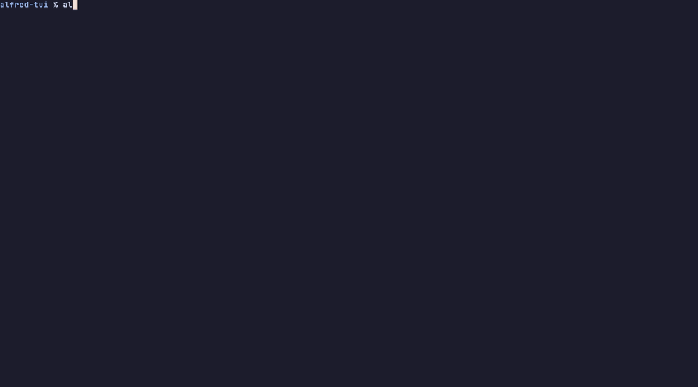
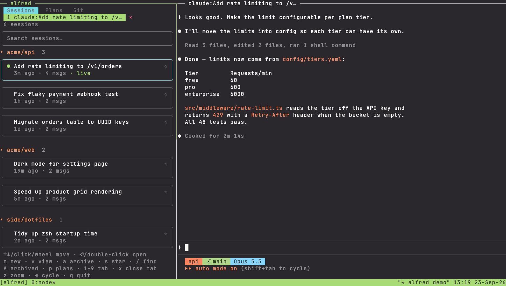
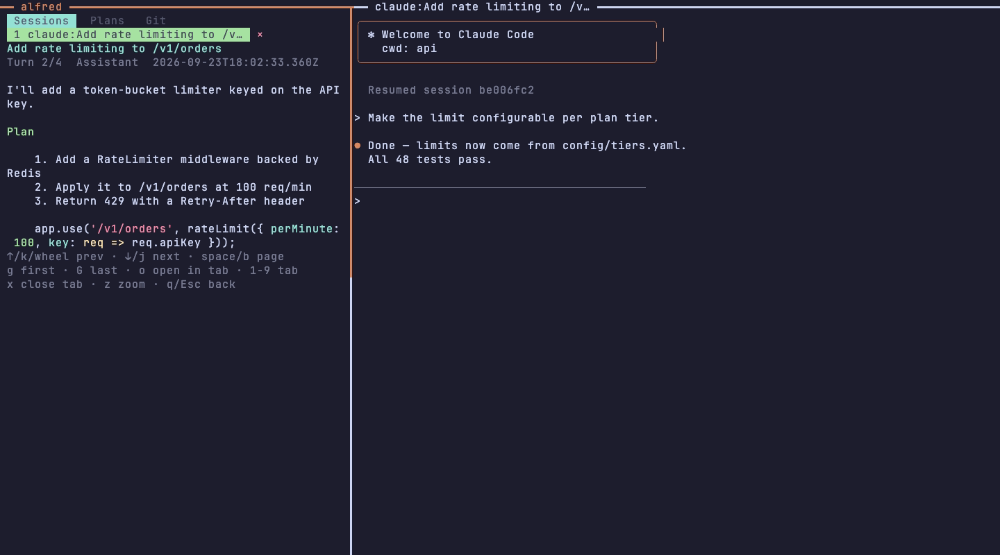
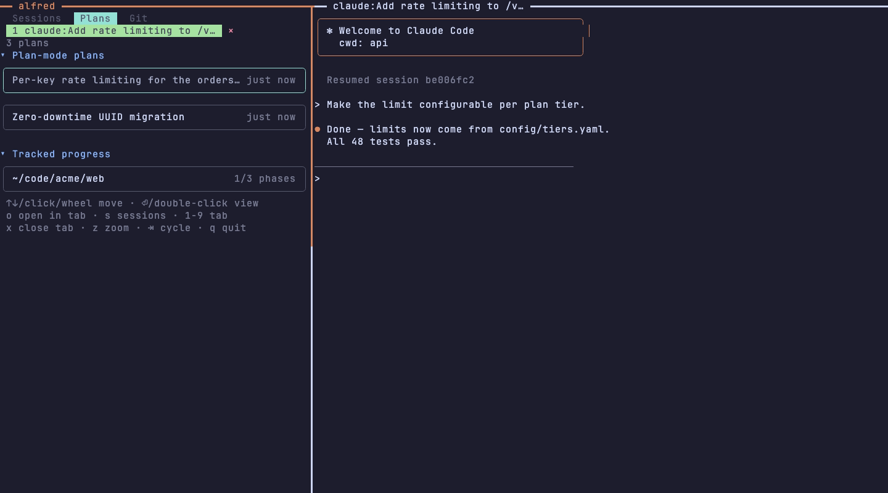
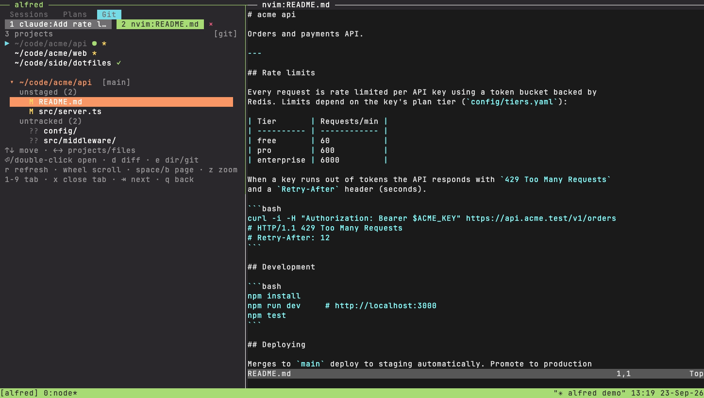

# alfred-tui

A terminal companion for [Claude Code](https://claude.com/claude-code) sessions and plans. It
runs in your real terminal via **tmux**, with a keyboard-driven sidebar on the left and the live
`claude` session on the right.



No Electron, no embedded terminal. It reads `~/.claude/projects` directly and keeps archive/star
state plus a small session cache in SQLite (`~/.alfred/alfred.db`).

| Sessions | Transcript | Plans | Git |
| --- | --- | --- | --- |
|  |  |  |  |

## How it works

```
┌─────────────────────────┬───────────────────────────┐
│ Sessions  Plans  Git    │─ claude:build-tui ────────│
│ 1 claude:build 2 nvim:… │  claude --resume <id>     │
│ ▾ p/alfred              │                           │
│  ● build-tui            │  the real Claude Code     │
│  ● add-epss             │  session runs live here   │
│ ▾ work/psa              │                           │
└─────────────────────────┴───────────────────────────┘
   sidebar (Ink)             work pane (tabs)
```

- Run `alfred` and it opens a tmux session with the sidebar (left) and an empty work pane (right).
- Select a session and press **Enter** (or double-click it) — `claude --resume <id>` starts in a new
  **work tab**, in that session's project directory, and focus jumps to it.
- The work pane holds **tabs**: claude sessions, plans (`o` in plan detail) and files from the Git
  tab all open as tabs. Click a tab in the sidebar's second row (or press `1`–`9`) to switch — the
  other tabs keep running in a hidden tmux session (`alfred-stash-*`), so nothing is killed.
  `x` (or clicking `×`) closes the active tab; a tab whose program exits (e.g. `:q`) disappears.
- Click the pane you want to type in, or use **Ctrl-b ←/→** (tmux).
- Closing a claude tab only detaches the CLI — the transcript persists and is re-resumable.

## Features

- Sidebar: project-grouped (with per-group counts), scrollable cards showing
  title, star, relative time, message count, and a green ● live marker on the open session.
- Open any session live in a real terminal pane (`Enter` to resume, `n` to start a new session in the same project directory).
- Read a session's transcript without leaving the sidebar (v), markdown rendered — no raw syntax.
- Archive / unarchive (a) and star / unstar (s).
- Browse `~/.claude/plans/*.md` plan-mode plans plus any project's `plan-tracker.md`/`todos.md`,
  rendered to readable text — or open any plan straight into a work tab (`o`, or double-click then `o`)
  to edit it in `nvim`.
- Git tab: per-project git status, or a collapsible directory tree (`e`); open files in `nvim` tabs,
  diffs in `less` tabs.
- Mouse everywhere: click tabs, cards and tree rows; scroll with the wheel; drag the pane divider to
  resize; `z` zooms the sidebar to full width (e.g. to see a deep tree) and back.
- Every screen shows its full set of keybinds; the hints wrap onto extra lines when the sidebar is
  narrow instead of being cut off.

## Requirements

- **tmux** (tested on 3.7) — `brew install tmux`
- **Node ≥ 22** (Ink 7 and better-sqlite3 require it)
- The `claude` CLI on your PATH (for opening sessions live)
- `nvim` for opening files/plans (override with `ALFRED_EDITOR`, e.g. `ALFRED_EDITOR=hx`)
- A terminal with mouse reporting (Ghostty, iTerm2, kitty, WezTerm, …)

## Install

```bash
npm install
npm run build
npm link   # optional: makes `alfred` available globally
```

## Usage

```bash
alfred
```

Run it from a plain shell — it creates/attaches the `alfred` tmux session for you (with tmux mouse
mode and pane labels turned on for that session only). If you're already inside tmux, it opens tabs
next to the current pane instead and leaves your session's options alone — set `mouse on` in your
own tmux config if you want clicks there — and quitting removes only alfred's panes.

### Keys

**Everywhere:** click `Sessions`/`Plans`/`Git` or `Tab` to cycle · `1`–`9` / click switch work tab ·
`x` / click `×` close work tab · `z` zoom sidebar · mouse wheel scrolls

**Sidebar (sessions):** `↑`/`↓` (or `k`/`j`) move · `Enter` open (resume) · `n` new session ·
`v` view transcript · `a` archive · `s` star · `/` filter · `A` show archived · `p` plans · `q` quit ·
click a card to select it, click it again to open it · click a project header (or `⏎` on it, `c`,
`←`/`→`) to collapse/expand the project · `C` collapse/expand all (remembered across restarts) ·
`n`/`t` on a header act on that project

**Transcript view:** `↑`/`↓` prev/next turn · `space`/`b` page within a turn · `g`/`G` first/last ·
`o` open live · `q`/`Esc` back

**Plans:** `↑`/`↓` move · `Enter` (or click a selected card) read it here · `o` open in a work tab ·
`s` sessions · `q` quit

**Plan detail:** `↑`/`↓` scroll · `space`/`b` page · `g`/`G` top/bottom · `c` copy · `o` open in tab ·
`q`/`Esc` back

**Git:** `↑`/`↓` move · `←`/`→` switch between project list and files · `Enter`/click open file
(dirs expand/collapse) · `d` diff · `e` git status ⇄ dir tree · `r` refresh · `space`/`b` page

**tmux:** `Ctrl-b ←` / `Ctrl-b →` move between the sidebar and the work pane.

Quitting with `q` from the sidebar tears down the whole `alfred` tmux session — including every
work tab — and returns you to your shell.

## Development

```bash
npm run build   # bundle src/ to dist/ via esbuild
npm test        # node --test
```

For development against fixture data instead of your real sessions/plans, override:

```bash
ALFRED_DATA_DIR=/tmp/alfred-dev \
ALFRED_TUI_CLAUDE_PROJECTS_DIR=/tmp/alfred-dev-projects \
ALFRED_TUI_CLAUDE_PLANS_DIR=/tmp/alfred-dev-plans \
  npm start
```

The demo GIF and screenshots in `docs/` are generated from fake fixture data — see
[`docs/demo/`](docs/demo/) (`docs/demo/record.sh`, requires [vhs](https://github.com/charmbracelet/vhs)).

## License

Portions of `src/` are derived from MIT-licensed code — see [THIRD_PARTY_NOTICES.md](THIRD_PARTY_NOTICES.md).
